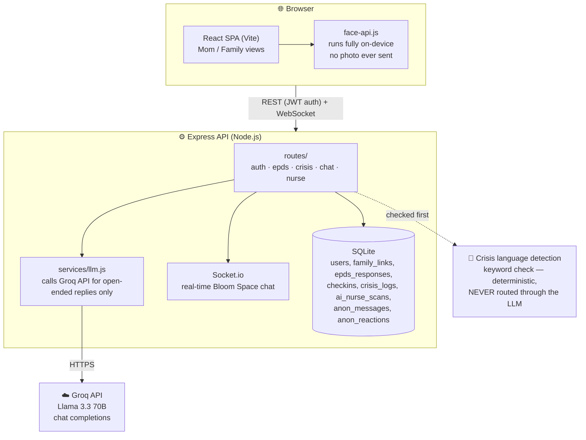

# Bloom — postpartum wellbeing support platform

A full-stack web app for postpartum depression awareness and support: mothers screen themselves
with the validated EPDS scale, family gets trend-level visibility (never raw answers), an
LLM-backed support chatbot offers emotional support and new-mom tips with a hard-coded crisis
safety net, a camera-based AI Nurse gives quick mood check-ins, and an anonymous peer space lets
mothers talk to each other freely.

**Team:** Neha Benny, Sanjana M Paul

## Stack
- **Backend:** Node.js + Express + SQLite (`better-sqlite3`) + JWT auth + Socket.io
- **Frontend:** React (Vite) + React Router + Recharts + face-api.js, custom design system (no UI library)
- **LLM:** Groq API (Llama 3.3 70B) for the conversational support chat, with deterministic keyword-based fallback

## Architecture



**Key design decision — safety before AI:** crisis-related language (self-harm, suicide,
"emergency help") is caught by a deterministic keyword classifier *before* anything reaches the
LLM. If it matches, the user always gets the same hard-coded response with real helpline numbers
— the LLM is never in that path at all. The LLM only handles open-ended emotional support and
casual conversation; baby-care tips (breastfeeding, sleep, etc.) are also static, curated content
rather than LLM-generated, so factual accuracy doesn't depend on model behavior.

**Privacy design — AI Nurse:** the mood-detection model (`face-api.js`, TensorFlow.js) runs
entirely in the browser. The camera photo never leaves the device — only the detected mood label
(e.g. "sad") and a confidence score are sent to the backend and stored.


**Key design decision — safety before AI:** crisis-related language (self-harm, suicide,
"emergency help") is caught by a deterministic keyword classifier *before* anything reaches the
LLM. If it matches, the user always gets the same hard-coded response with real helpline numbers
— the LLM is never in that path at all. The LLM only handles open-ended emotional support and
casual conversation; baby-care tips (breastfeeding, sleep, etc.) are also static, curated content
rather than LLM-generated, so factual accuracy doesn't depend on model behavior.

**Privacy design — AI Nurse:** the mood-detection model (`face-api.js`, TensorFlow.js) runs
entirely in the browser. The camera photo never leaves the device — only the detected mood label
(e.g. "sad") and a confidence score are sent to the backend and stored.

## Project structure

thanal/
backend/ Express API + SQLite database + Socket.io server
frontend/ React app (Vite)


## Running it locally

You need Node.js 18+ installed.

### 1. Backend
```bash
cd backend
npm install
cp .env.example .env
```
Edit `.env` and fill in:

PORT=4000
JWT_SECRET=<any long random string>
GROQ_API_KEY=<your key from console.groq.com>
GROQ_MODEL=llama-3.3-70b-versatile

`GROQ_API_KEY` is optional — without it, the support chat still works, just with a static fallback
reply instead of a live LLM response.
```bash
npm run dev
```
Runs on `http://localhost:4000`. The SQLite database file is created automatically at
`backend/db/thanal.db` on first run — nothing else to set up.

### 2. Frontend
In a second terminal:
```bash
cd frontend
npm install
npm run dev
```
Runs on `http://localhost:5173` and proxies `/api` and `/socket.io` to the backend during local
development.

Open `http://localhost:5173` in your browser.

## How the roles work
1. Register as a **mother** — you get a 6-character invite code (shown on your dashboard).
2. Share that code with a family member. They register as **family**, enter the code, and are
   linked to your account. Once linked, their dashboard is labeled with her name — e.g.
   "**Anu's Team**" — instead of a generic "family member" label.
3. Family members can only ever see her EPDS **score + risk level trend**, her latest AI Nurse
   mood reading, and a plain-language weekly summary — never her individual screening answers.
   That boundary is enforced server-side (see `routes/epds.js`, the `/family/:momId` endpoint
   only ever selects `score, risk_level, created_at`).

## What's implemented
- **Auth:** JWT-based, two roles (mom / family), invite-code linking
- **EPDS screening:** the real 10-item Edinburgh Postnatal Depression Scale, scored server-side,
  with risk bands (low / moderate / high) and a self-harm flag on item 10
- **Daily check-ins:** quick mood/sleep sliders + optional note
- **Trend charts:** score-over-time with reference lines at the clinical risk thresholds
- **Weekly summary:** plain-language summary for family, combining EPDS trend, check-in
  averages, and the latest AI Nurse reading
- **Immediate Help chatbot:** deterministic crisis-language detection (always routes to real
  helpline numbers, never the LLM) + Groq-backed conversational replies for everything else +
  curated new-mom tips (breastfeeding, sleep, crying/colic, feeding, self-care, bonding)
- **AI Nurse:** on-device camera mood detection (face-api.js) with contextual instructions;
  photo never leaves the browser, only the mood label is stored
- **Bloom Space (anonymous peer chat):** random alias per user, real-time via Socket.io, full
  message actions — send, edit, delete (soft-delete, shows "[message deleted]"), threaded reply,
  emoji react (toggleable), and report. Mom-only.
- **Understanding PPD:** role-adaptive education page — self-care framing for mothers, "how to
  help" framing for family
- **Emergency Help page:** always-accessible helpline directory, independent of chatbot triggers
- **Daily motivational quotes** and **family reminders** (rotate daily) on both dashboards
- **Mother-baby themed design system:** warm blush/rose palette, custom typography, no default
  UI library


## Important note
This is a screening and awareness tool, not a diagnostic or clinical system. If you present
this in interviews or your seminar, frame it that way — EPDS is a validated screening
instrument and the AI Nurse is an approximate camera-based reading, not a diagnosis. Either
should prompt a conversation with a real professional, not replace one.

## Team Members
Sanjana M Paul,
Neha Benny
